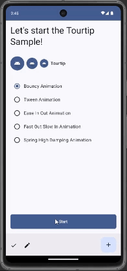

# Tourtip

Tourtip is a guided tour library for Android applications, built using Jetpack Compose. This library
allows you to create customizable tooltips that guide users through various features of your
app.



## Features
- **Customizable Tooltips:** Easily create tooltips with custom styles, positions, and animations.
- **Step-by-Step Guidance:** Provide users with step-by-step instructions to enhance their
  onboarding experience.
- **Compose Integration:** Built with Jetpack Compose for seamless integration into your Compose UI.

<!-- start dependency -->
## Installation

[](https://central.sonatype.com/artifact/com.fappslab.tourtip/tourtip/1.06.1)

### Groovy
Add the following dependency to your `build.gradle` file on app module:

```gradle
dependencies {
    implementation 'com.fappslab.tourtip:tourtip:1.06.1'
}
```

### Kotlin
Add the following dependency to your `build.gradle.kts` file on app module:

```kotlin
dependencies {
    implementation("com.fappslab.tourtip:tourtip:1.06.1")
}
```
<!-- end dependency -->

## Usage

### Basic Setup
To start using Tourtip, initialize the library in your Compose setup.

```kotlin
// Initialize Tourtip in your Composable
TourtipLayout(
    onBack = { currentStep ->
        // Optional: Handle back action for event tracking $currentStep
    },
    onNext = { currentStep ->
        // Optional: Handle next action for event tracking $currentStep
    },
    onClose = { currentStep ->
        // Optional: Handle close action for event tracking $currentStep
    },
    onClickOut = { currentStep ->
        // Optional: Handle click outside action for event tracking $currentStep
    }
) { controller ->

    // Screen content
    // ...
    // ...
    Button(onClick = { controller.startTourtip() }) {
        Text("Start Tour")
    }
}
```

### Creating a TooltipModel
Create a tooltip to guide users through specific features of your app.

```kotlin
// Example how to attach a tooltip to a Text composable
Text(
    modifier = Modifier
        .fillMaxWidth()
        .tooltipAnchor { // Attach the tooltip to any composable component.
            TooltipModel(
                index = 0,
                title = { Text("Step 1") },
                message = { Text("This is the first step of the tour.") },
                highlightType = HighlightType.Rounded
            )
        },
    text = "Let's start the Tourtip Sample!",
    style = MaterialTheme.typography.headlineLarge,
)
```

### Customizing Tourtip
Customize the appearance and behavior of tooltips to fit your app's design.

```kotlin
TourtipLayout(
    animType = TourtipAnimType.Bouncy,
    scrimColor = Color.Blue.copy(alpha = 0.5f), // Optional scrim color
    backgroundColor = Color.Red // Optional Bobble background color
) { controller ->

    Text(
        modifier = Modifier
            .fillMaxWidth()
            .tooltipAnchor {
                TooltipModel(
                    index = 0, // You can use the index to control the order of the balloons. The index does not need to be sequential but must be unique and positive.
                    title = { Text("Step 1") },
                    message = { Text("This is the first step of the tour.") },
                    highlightType = HighlightType.Rounded // You can use the HighlightType to define the shape of the highlight: Rectangle, Rounded, Circle, or Custom.
                )
            },
        text = "Let's start the Tourtip Sample!",
        style = MaterialTheme.typography.headlineLarge,
    )
    Spacer(Modifier.size(32.dp))
    Text(
        modifier = Modifier
            .fillMaxWidth()
            .tooltipAnchor {
                TooltipModel(
                    index = 1,
                    title = { Text("Step 2") },
                    message = { Text("This is the last step of the tour.") },
                    highlightType = HighlightType.Rounded,
                    action = { controller ->
                        Button( // You use any composable component to define the action of the last tooltip.
                            onClick = {
                                controller.finishTourtip()
                            }
                        ) {
                            Text(text = "Finish")
                        }
                    }
                )
            },
        text = "Last step of the tour."
    )
    Spacer(Modifier.size(32.dp))
    Button(
        modifier = Modifier.fillMaxWidth(),
        onClick = { controller.startTourtip() }
    ) {
        Text("Start Tour")
    }
}
```

## Contributing
We welcome contributions! If you'd like to contribute to Tourtip, please follow these steps:

1. Fork the repository.
2. Create a new branch from `develop` (`git checkout -b feature/my-amazing-feature`).
3. Make your changes.
4. Commit your changes (`git commit -m 'Changed: My amazing feature'`).
5. Push to the branch (`git push origin feature/my-amazing-feature`).
6. Create a new Pull Request to the `develop` branch.

## License
Tourtip is licensed under the Apache 2.0 License. See the [LICENSE](LICENSE) file for more information.
